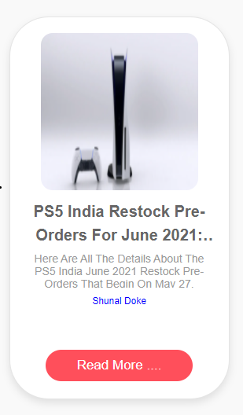
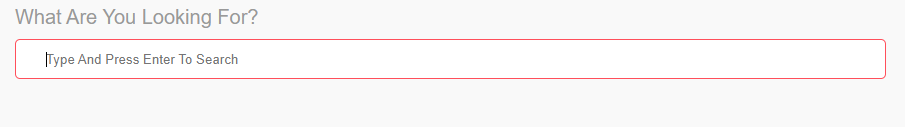
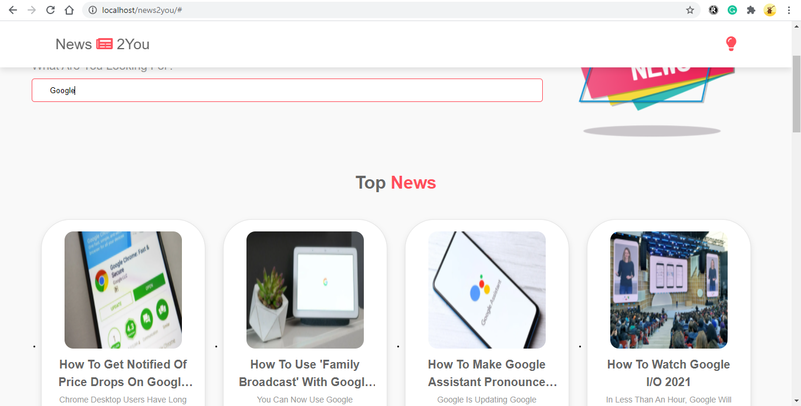
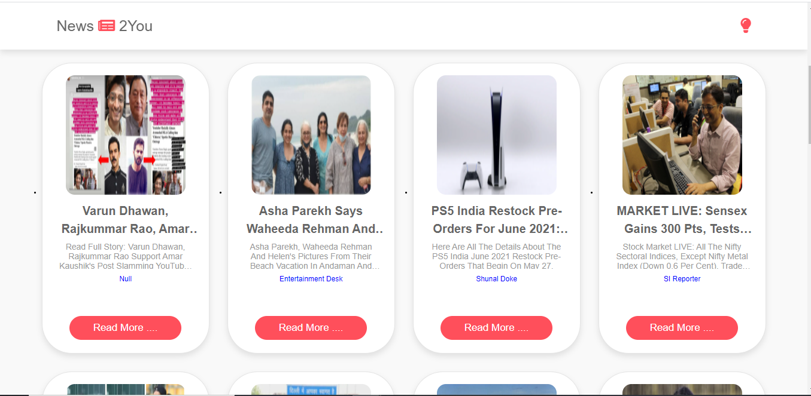
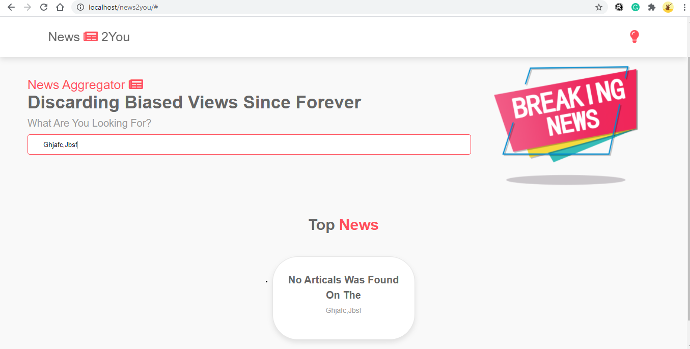
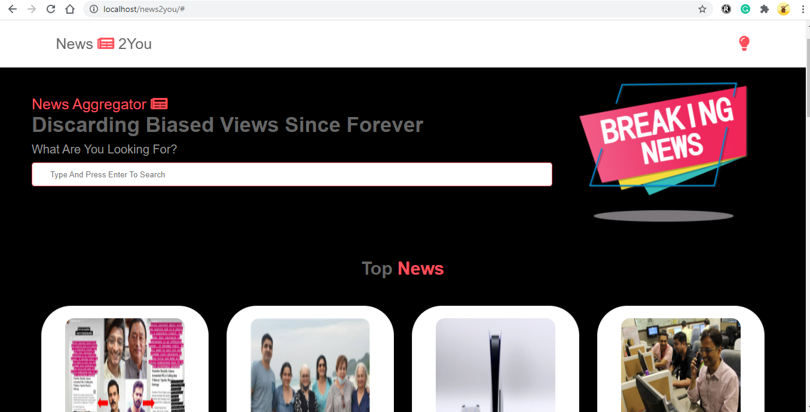

# Assignment_News_aggregator 📢 🗞🗞

## User Story 1

```
When user opens the app, he able to view the top headlines fetched by the API
```
## Display the article with card

<table style="width:100%">
  <tr>
    <th><b> Reference Image<b></b></th>
      
  </tr>
  <tr>
    <td></td>
  </tr>
</table>

## User Story 2

 `Enable the search functionality for users to filter news based on the search keyword`
 


## Enable the search functionality in the search bar

`i.e => serach for google artical`



## card structure



## Invalid Search

```
When invalid searches(For eg: "asasdasd") are made, ensure that the screen displays "No article was found based on the search."(Put the text in an element with class name "not-found")
```


## theme

`Enable ability to switch between dark mode(Background is black) and light mode(Background is white)`


