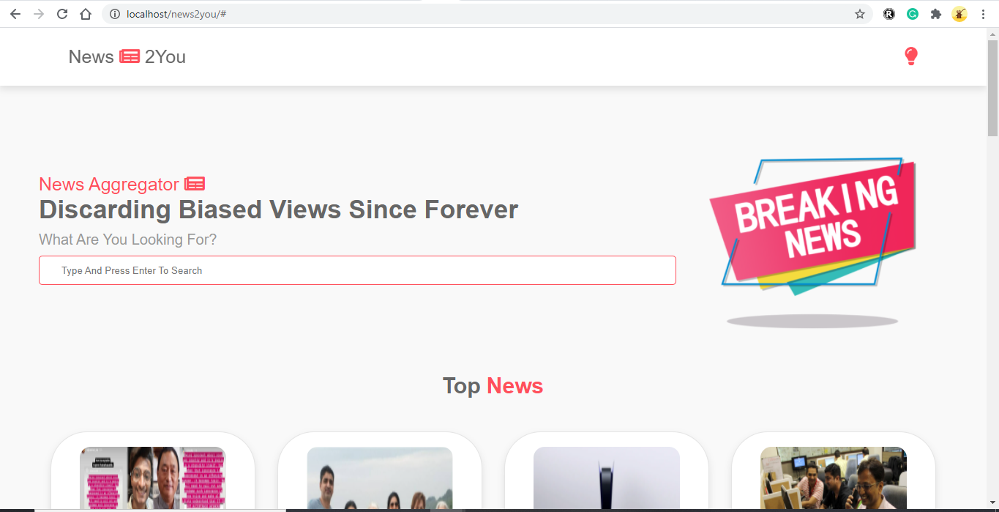

# Assignment_News_aggregator 📢 🗞🗞

## User Story 1

```
When user opens the app, he able to view the top headlines fetched by the API
```
## Display the article with card

<table style="width:100%">
  <tr>
    <th><b> Reference Image<b></b></th>
      
  </tr>
  <tr>
    <td></td>
  </tr>
</table>

## User Story 2

 `Enable the search functionality for users to filter news based on the search keyword`
 

